# Unityの基本を学ぼう

## 1. Unityプロジェクトの作成

UnityHUBを起動し，`NewProject`（新規プロジェクト）を選択する．

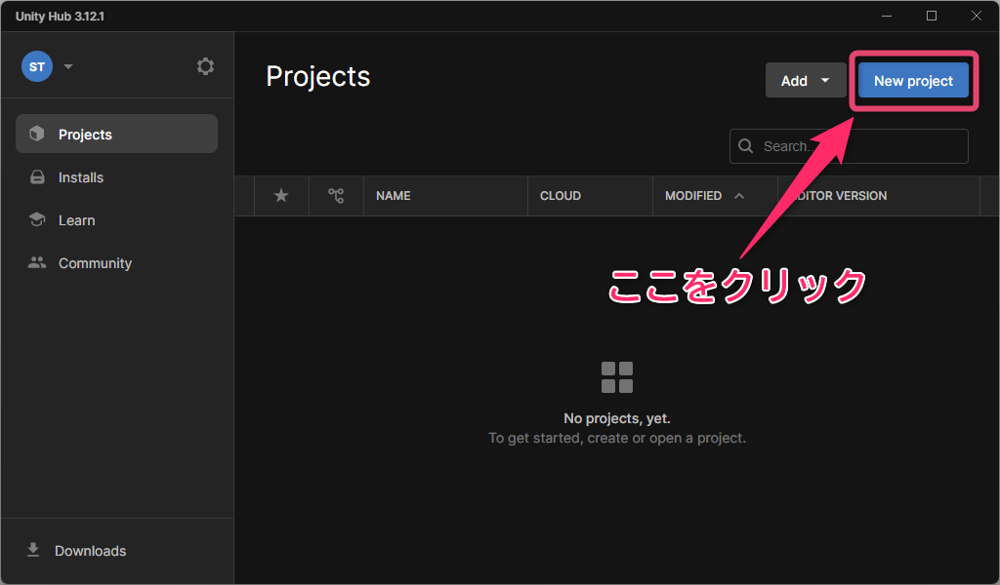

もし，Unityの異なるバージョンがインストールされている場合は，下記に従い，Unityのバージョン（`6000.0.45f1`）に変更る．

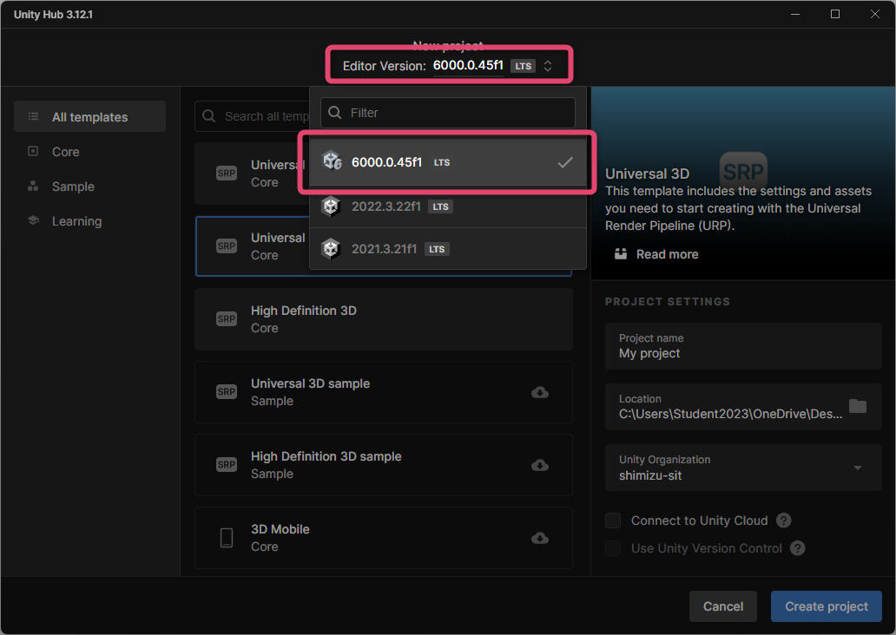

- ここで指定した「**プロジェクト名**」がこれから作るゲームのフォルダ名になる．
- このフォルダに，Unityを実行するための沢山のファイルが保存される．作成したUnityのプロジェクトを別の場所にコピーする場合は，このフォルダ全てのファイル・データが必要になる．フォルダの扱い・保存方法は，このページの最後で説明しているので参照すること．
- 「**プロジェクトを作成**」ボタンを押す前に，フォルダが保存される場所を確認すること（保存場所をデスクトップにしておくと，後で確認がしやすい）

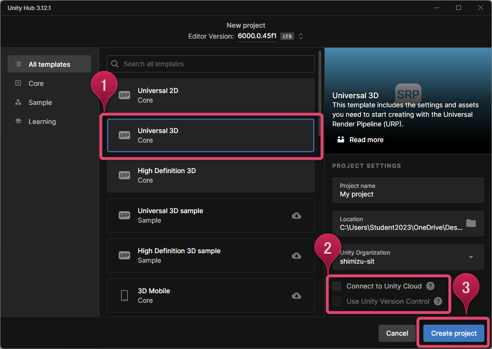

## 2. Unity画面構成
ゲーム画面に表示されるオブジェクトを**ゲームオブジェクト**と呼ぶ．このゲームオブジェクトをゲーム画面に自由に配置し，操作することでゲームが成立する．この様々な操作を行うための各種メニュー・ツールはUnityウィンドウから操作・確認できる．

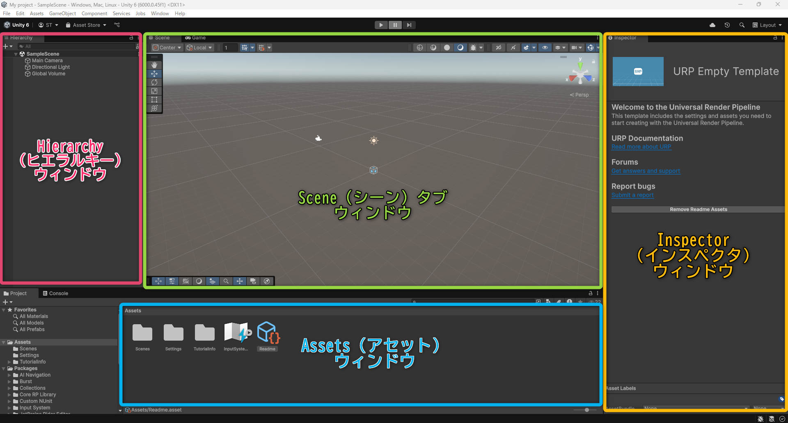

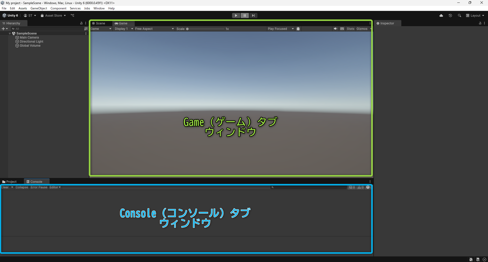

| 名称 | 説明 |
|---|---|
| Hierarchy |全てのゲームオブジェクトを階層的に一覧表示する |
| Scene | この中にゲーム画面を想定して，ゲームオブジェクトを配置する．ゲーム全体の世界を，このScene空間に作成する |
| Inspector | ゲームオブジェクトの全ての属性情報が表示される |
| Assets | 左の階層メニューの中からAssetsを選択すると右側にAsstesフォルダの中身が表示される．具体的には，フォルダの中に保存されているゲームで使用しているゲームオブジェクトや，プログラム（スクリプトと呼ぶ）の一覧がアイコンで表示される |
|  Game | 上部のGameタブをクリックすると，SceneウィンドウがGameウィンドウに切り替わる．このウィンドウに実際のゲーム画面が表示される |
|   Console | Projectタブの横にあるConsoleタブをクリックすると，Assetsウィンドウが，コンソールに切り替わる ．エラーメッセージや，スクリプトで指定した出力結果が表示される |

### (1) Unityを操作する各種ツール及びメニューボタン

ゲームを構成する空間はSceneと呼ばれ，「Scene」タブを選択すると表示される．ゲーム実行時に表示されるゲーム画面は，「Game」タブをクリックすると表示される

（Hierarchyウィンドウ内のMainCameraを選択すると，シーン画面内において，ゲーム画面を確認できる）

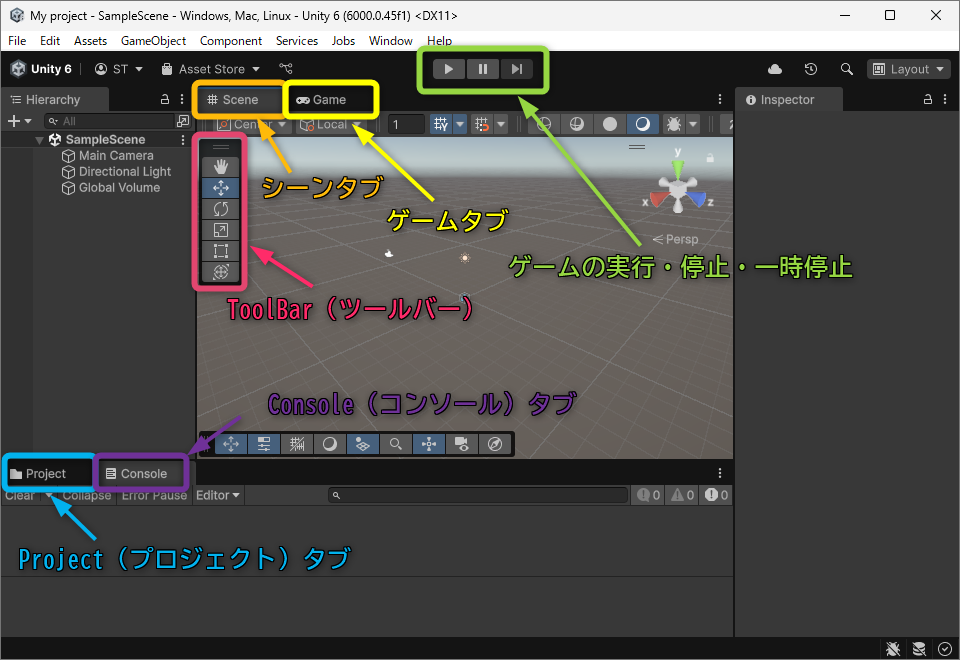

### （2）ゲーム画面を映し出すMain Camera（メインカメラ）

ゲームタブをクリックするとゲーム画面に切り替わる。Scene空間にメインカメラを配置し、このカメラで映しているシーン（映像）が、ゲーム画面として表示される。

Sceneタブをクリックしたあと、HierarchyウィンドウでMain Camera（メインカメラ）を選択すると、

Sceneウィンドウの右下に、カメラ画像が表示される。これがゲーム画面である。ゲームタブをクリックすると、このゲーム画面が拡大されて表示される。

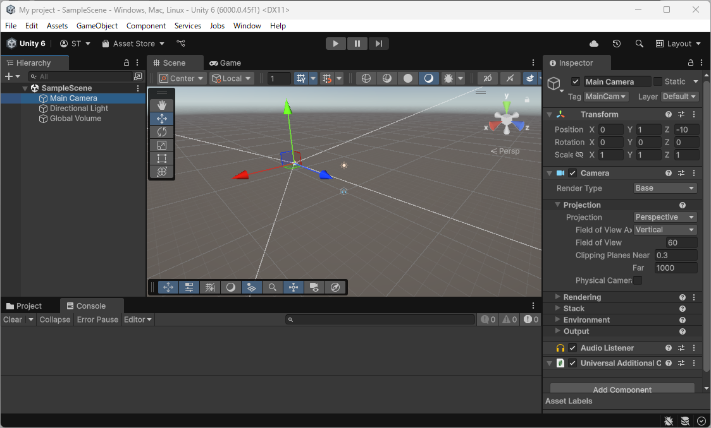

## 3. ゲームオブジェクトの基本操作

ゲーム画面に配置するオブジェクトをゲームオブジェクトと呼ぶ。以下、ゲームオオブジェクトの操作方法を説明する。

### (1) ToolBoxの操作方法

次の①，②，③は、操作例として、ゲームオブジェクトを移動・回転・拡大縮小を行う手順を説明している．

Hierarchyウィンドウ或いはシーン画面内で選択し、ツールバーから各種アイコン（ボタン）を選択する（クリックする）．

① Move Toolを使って平行移動

- 赤：ｘ軸
- 緑：ｙ軸
- 青：ｚ軸

② Rotate Toolを使って各軸周りの回転

- 赤：x軸周りの回転
- 緑：y軸周りの回転
- 青：z軸周りの回転

③  Scale Toolを使ってサイズ変更

- 赤：ｘ軸方向のスケール変更
- 緑：ｙ軸方向のスケール変更
- 青：ｚ軸方向のスケール変更
- 白（原点）：x,y,z軸方向同時にスケール変更

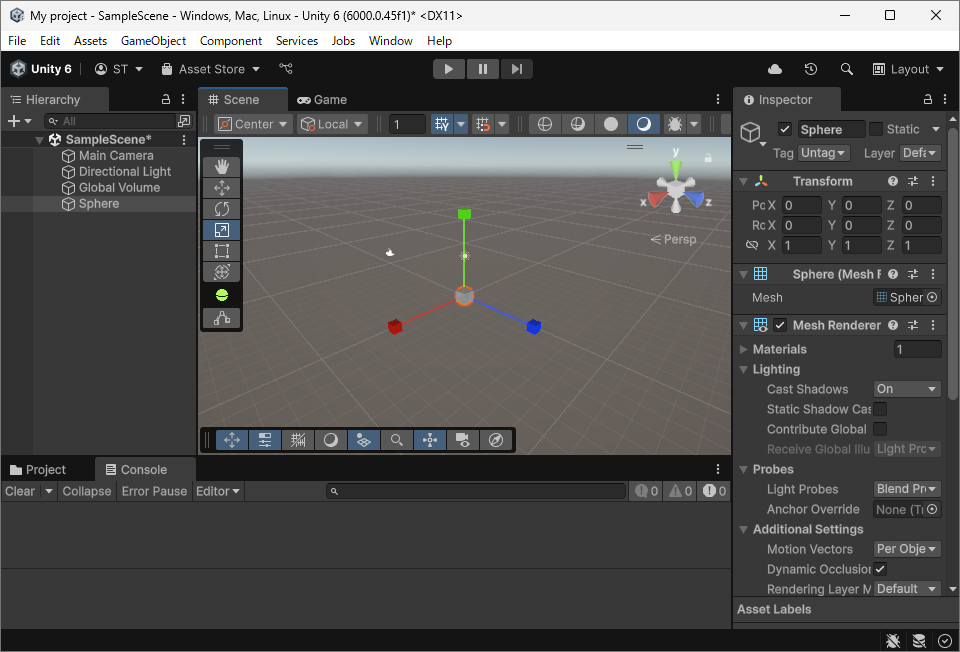

> ※移動，回転，スケールの値は，Inspectorウィンドウで確認できる．InspectorウィンドウのTransformの数値を直接変更してもよい．

### 下図のように，Unityの動きを理解するために，板（Cubeを変形させ，板状にする）の上に球（Sphere）を配置しなさい．

- Cubeの`ｘ, z`軸のスケールは5倍
- Cubeを`z`軸周りに少し回転させる

#### Cubeの`x,z`軸のスケールは5倍

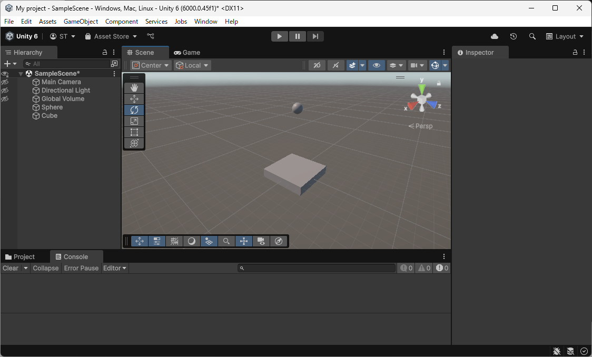

#### Cubeを`z`軸 （青色の軸）周りに少し回転させる

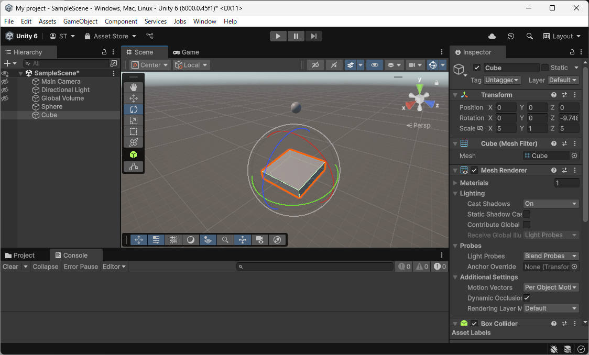

## 4. コンポーネントの追加

### (1) Sphereに物理属性並びに衝突判定のコンポーネントを追加する

1. Sphereに対して，下記コンポーネントを追加する

>Physics -> Rigidbody （物理属性）  
>Physics -> Sphere Collider（衝突判定）

2. 実行ボタンを押す．

Sphereに重力が掛かるようになり，下に落下するようになる．また，Cubeには衝突判定のコンポーネントが追加されていないため，球はCubeをすり抜けてしまう．

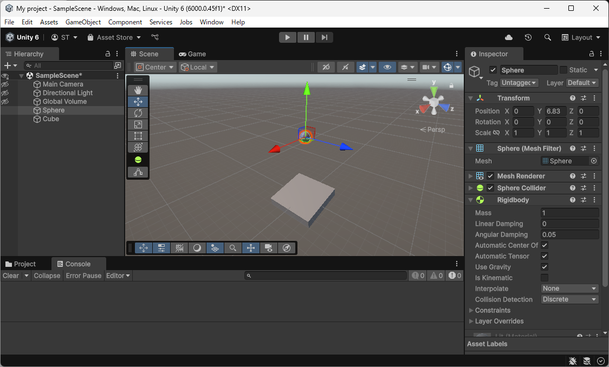

### (2) Cubeに衝突判定のコンポーネントを追加する

1. Cube（立方体）のゲームオブジェクトをHierarchyウィンドウで選択し，Unity画面右側に表示されたInspectorウィンドウにあるAddComponentボタンをクリックする
2. ポッポアプウィンドウから，下記コンポーネントを選択する．これによりCubeに衝突判定のコンポーネントが追加される

> Physics -> Box Collider

inspectorウィンドウにコンポーネントが追加されていることを確認する． 

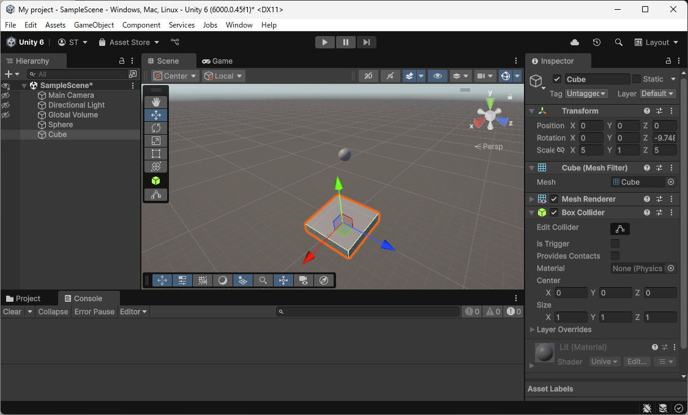

※コンポーネント設定方法など，詳細な説明は後で行う．ここでは，どのような事ができるかのイメージが理解できれば良い．

## 5. GameObject（ゲームオブジェクト）のコンポーネントとは？
コンポーネントは，ゲームに必要な様々な機能のライブラリのようなもの．様々なコンポーネントを組み合わせて，ゲームとしての様々な機能を実現していくことができる

### (1) Transformコンポーネント

ゲームオブジェクトをゲーム画面に追加した時点で，自動的にTransformコンポーネントが追加され，位置，回転，スケールなどを変更することができるようになる

### (2)  Unityで用意されているコンポーネント

AddComponentで，Unityで予め用意されている様々な機能をコンポーネントとして自由に追加できる

**例：物理法則に合わせて動かしたい場合**

・Unityにはゲーム製作に必要な様々なコンポーネント（機能）が用意されていて，このゲームオブジェクトに，必要に応じて追加していくことができる

### (3)  Unityに用意されていない，オリジナルの機能を持つコンポーネント

独自の機能は，スクリプトを作成し，そのスクリプトをコンポーネントとして追加することで，機能追加ができる．

**独自設計を追加**

- Unityのコンポーネントとして用意されていない独自の機能を追加する場合は，C#言語のスクリプトを作成することで機能を追加することができる．

## 6. Unityのファイル構成

保存したUnityProjectフォルダの中の、Assetsというフォルダの中を確認する 先ほど作成したゲームオブジェクト並びに保存したシーンファイル(拡張子がunity)が、 フォルダ内にあることを確認する

 Unityはこれらの9つ全てのフォルダ（或いはファイル）が揃っていないと、実行でいない。そのため、一部のファイルのみを取り出す、或いは、ファイルの場所を変更するなどは絶対に行わないこと

## 7. シーンの保存、プロジェクトの保存

最初にゲームのシーンを保存するために，Save Asを選択し，シーンの名前（例えば Main）を指定する

2回目以降は，Saveを選択すれば良い．更新情報が保存される．

ゲーム画面を追加・修正した場合は，こまめにシーンを保存しておこう（保存しておけば，いつでも保存時の状態を復帰させることが出来ます）

次に，ファイルメニューのSave Projectを選択し，Unityプロジェクト全体を保存する．