# UnityでC#プログラミングをしてみよう

## 準備

### サンプルプロジェクトのダウンロード

下記サイトからZIP形式でダウンロードしてください．

https://github.com/shimizu-sit/SampleProject-2025

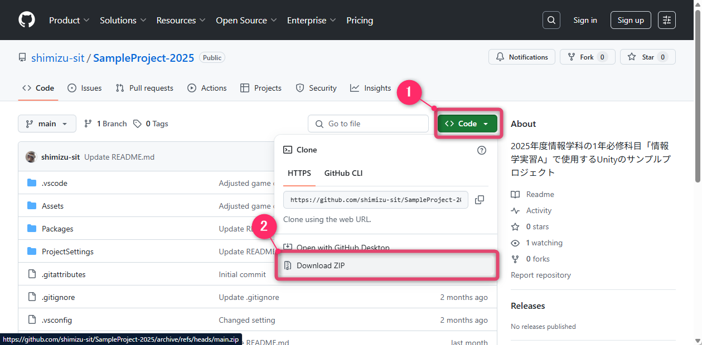

- ダウンロードが始まりますので適切な場所（例：デスクトップなど）に保存してください
- 保存する場所基本的に自由ですが，ローカル（例：デスクトップ，ドキュメントなど）に保存してください（Google Driveなどには保存してないでください）
- ダウンロードした「**SampleProject-2025.zip**」を選択した状態で，「**すべて展開**」をクリックします

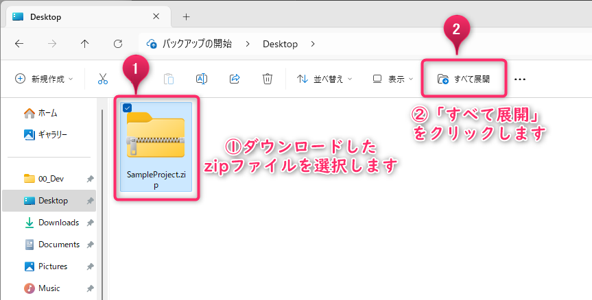

- 「**圧縮（ZIP形式）フォルダーの展開**」というウィンドウが表示されて適切な場所を選択して右下にある「**展開**」をクリックしてください

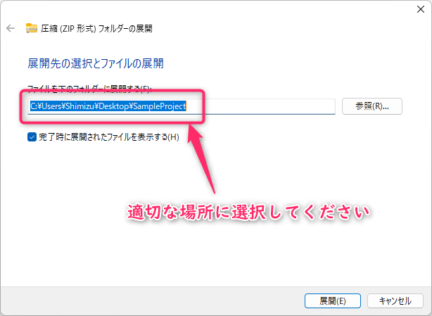

- 正しくZIPファイルが展開できれば以下のように「**SampleProject-2025**」フォルダが生成されます

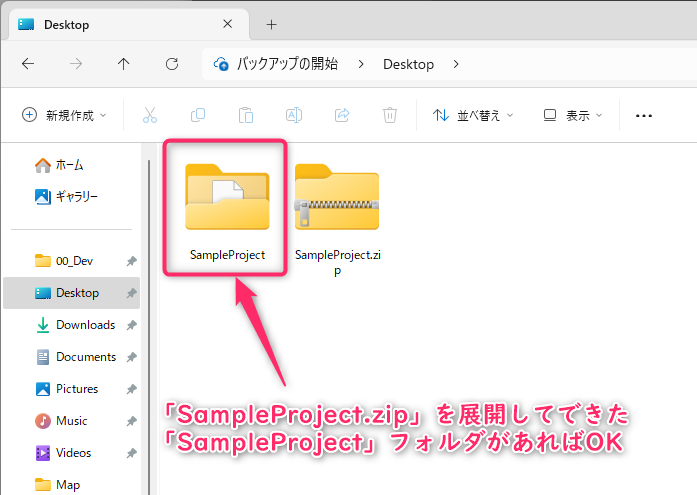


### サンプルプロジェクトを起動する

- 「**Unity hub**」を起動してください
- 追加するUnityプロジェクトを選択するために「**Add**」を選択して「**Add project from disk**」をクリックしてください
- 「**Select a project to open…**」というウィンドウが表示されるので先程展開した「**SampleProject-2025**」を選択して右下にある「**Open**」をクイックしてください
- 「**Open**」をクリックすると自動的にUnityが起動します
- 起動には少し時間（基本1,2分で長くても5分程度）がかかりますので少し待ちます
- Unityが起動したら「**Assets**」内にある「**Scenes**」を選択してください
- 「**Scenes**」の中にある「**PinBall**」をダブルクリックしてください

これで準備完了です

---

## 今回の目標

- 「キー入力」のスクリプトをアタッチする
- ボールを「跳ね返す」スクリプトを書く
- 「失敗」（取り損ねた）ボールの消去
- 「リプレイ」をつくりましょう
- ボールを跳ね返すオブジェクト
- 回転するオブジェクト
- 課題

## 「キー入力」のスクリプトをアタッチする

### Ballオブジェクトの設定

- Ballに「**Rigidbody**」と「**Physic Material**」をつける

### 「Rigidbody」を追加

- 「**Hierarchy**」から「**Ball**」オブジェクトを選択した状態で右側にある「**Inspector**」をみて下までスクロールします
- 「**Inspector**」内の一番下にある「**Add Component**」をクリックして「**Physics**」を選択します
- 「**Physics**」内にある「**Rigidbody**」をクリックします
- 「**Ball**」オブジェクトの「**Inspector**」内に「**Rigidbody**」コンポーネントが追加されている事を確認してください

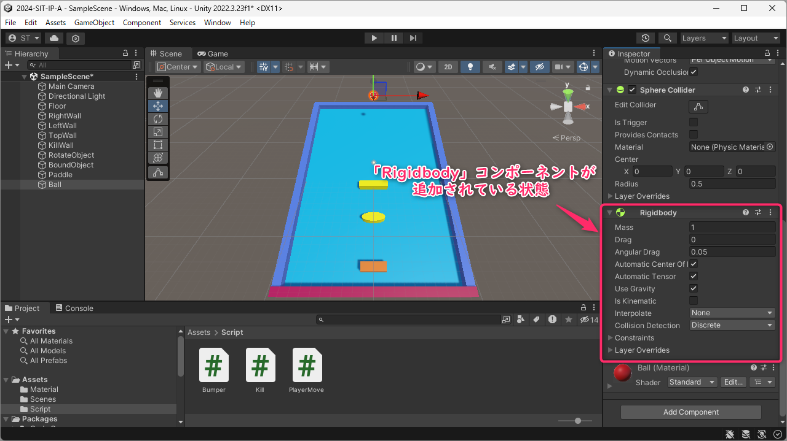

### 「Physic material」を追加

- オブジェクトにセットする「**材質**」によって跳ね返り方が変化します
- **Asset** > **Create** > **Physic Material**を選択します

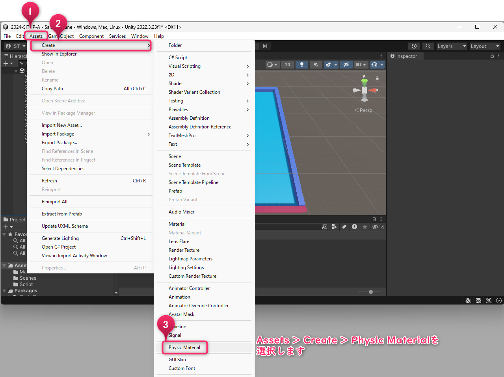

- 「**Assets**」内に「**New Physic Material**」が作成されますので，それを右クリックして「**Rename**」を選択して名前を「**Ball**」に変更
- します

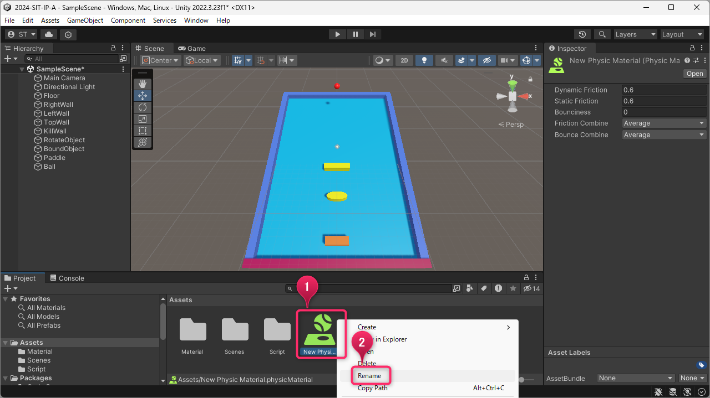

- 「**Ball**」フィジクマテリアルを選択すると「**Inspector**」に**Physic Material**のパラメータが表示されます

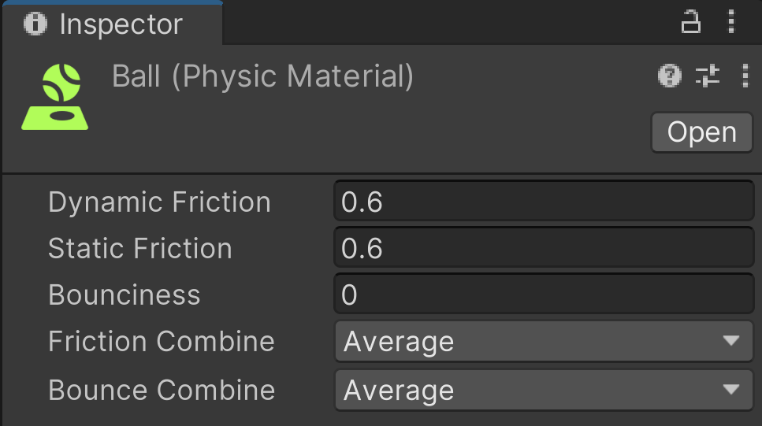

- 「**Physic Material**」の設定内容

|       **項目**       |                 **説明**                 |          **値の範囲など**          |
| -------------------- | ---------------------------------------- | ---------------------------------- |
| **Dynamic Friction** | 移動するオブジェクトにかかる摩擦         | 0 = 摩擦がない　1 = すぐに止まる   |
| **Static Friction**  | 静止してるオブジェクトにかかる摩擦       | 0 = 摩擦がない　1 = 動きにくい     |
| **Bounciness**       | 跳ね返りの大きさ                         | 0 = 跳ね返らない　1 = よく跳ね返る |
| **Friction Combine** | 衝突したオブジェクト間の摩擦             | 今回は初期値のAverageのまま        |
| **Bounce Combine**   | 衝突したオブジェクト間の跳ね返りの大きさ | 今回は初期値のAverageのまま        |

今回はスーパーボールのような挙動にしたいので**Dynamic Friction**と**Static Friction**は**0**に近い値に設定します．さらに**Bounciness**は**1**に設定します．

- 作った「**Ball**」フィジックマテリアルを「**Ball**」オブジェクトに**attach**（追加）します
  - **attach**する方法は3つあります
    1. 「**Hierarchy**」上の「**Ball**」にattachする方法
    2. 「**Scene**」ビュー上の「**Ball**」にattachする方法
    3. 「**Ball**」の「**Inspector**」内の「**Sphere Collider**」の「**Material**」にattachする方法

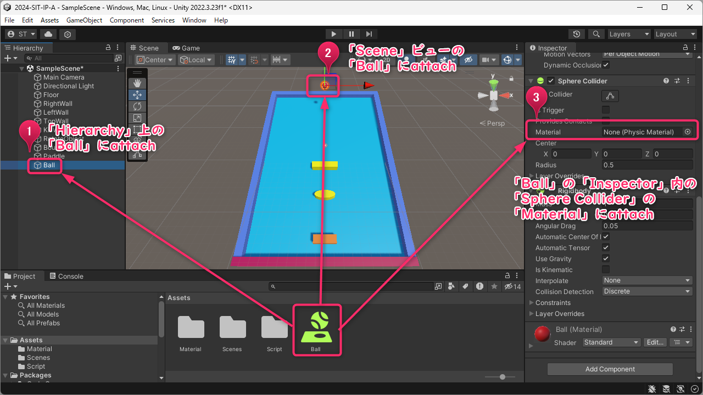

- 「**Play**」を押して実行してみましょう
  - Ballの跳ね返り具合などを調整してください

- キーボードの右左の方向キーで操作する「**PlayerMove**」スクリプトグラフを「**Paddle**」オブジェクトにattachします

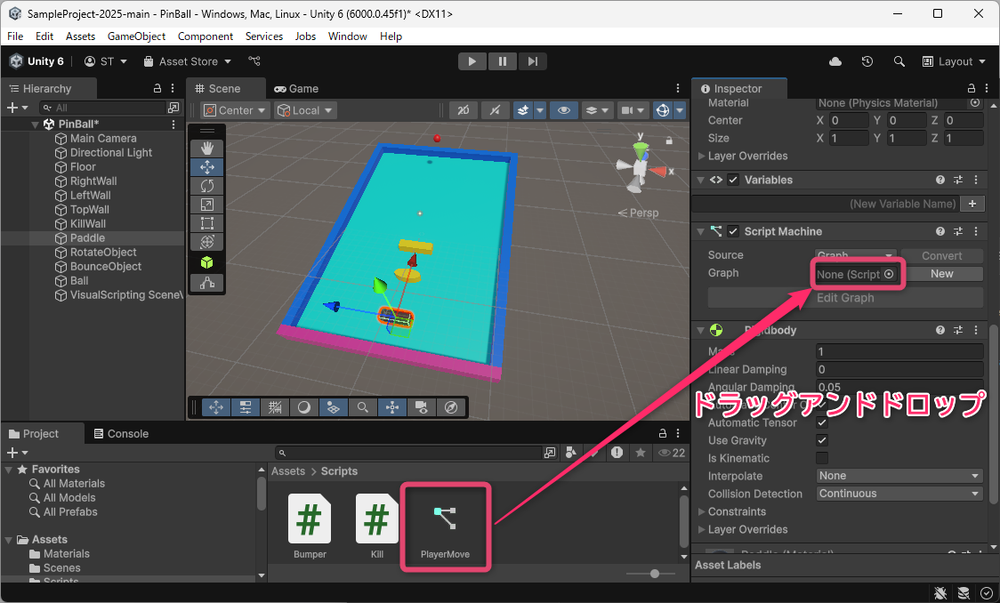

- PlayerMoveスクリプトグラフの中身は以下の様になっています

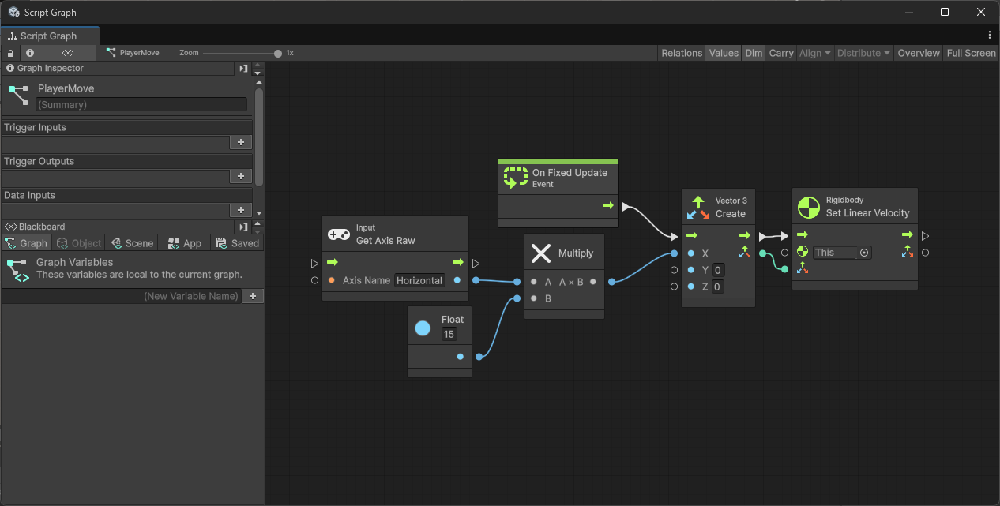

これは，以下のC#プログラムとほぼ同等の動きをします．

```cs
using System.Collections;
using System.Collections.Generic;
using UnityEngine;

public class PlayerMove : MonoBehaviour
{
    // float型でspeed変数を定義し15を代入
    public float speed = 15f;

    void FixedUpdate()
    {
        // キー入力の取得と速度の計算
        var velox = speed * Input.GetAxisRaw("Horizontal");

        // Rigidbodyコンポーネントを取得して速度を設定
        GetComponent<Rigidbody>().velocity = new Vector3(velox, 0f, 0f);
    }
}
```

- 「**Paddle**」オブジェクトに「**Rigidbody**」を追加します
- 「**Paddle**」オブジェクトの「**Rigidbody**」に調整を行います
- 「**Rigidbody**」内にある「**Constrains**」でPlayerの移動方向，回転方向を決めることができます
- 今回はPlayerが **「X軸方向」のみ** に移動すればよいので「**Freeze PositionのX以外**」にチェックをいれます

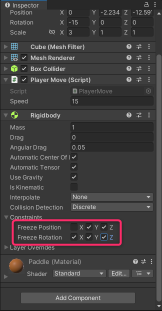

- 「**Play**」を押して実行してみましょう
  - 方向キーに左右を押して「**Paddle**」が左右に移動することを確認してください

## ボールを「跳ね返す」スクリプトを書く

### よく跳ねるためにはどうすればよいか？

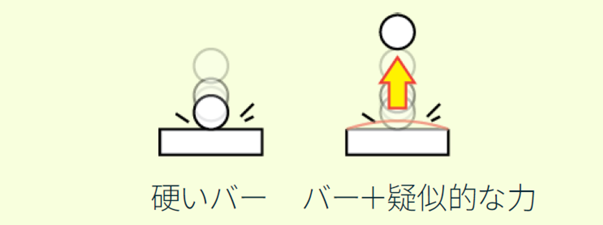

- 物理シミュレーションでは「**Paddle**」に当たった後はいずれ止まってしまいます
- 当たった時に，擬似的な「**はね返す力**」を上方向に加えることで，はね続けるボールをつくることができます

### 「跳ね返す」スクリプトを書く

- 「跳ね返す」スクリプト＝「**Bumper**」スクリプト
- 当たった相手に上向きの力を加えるスクリプトです

```cs
using System.Collections;
using System.Collections.Generic;
using UnityEngine;

public class Bumper : MonoBehaviour
{
  // float型でbounce変数を宣言し10を代入
  public float bounce = 10f;
  
  void OnCollisionEnter(Collision other)
  {
    // 衝突したオブジェクトのRigidbodyに力を加える
    // x軸方向には0の力を，Y軸方向にはbounce/6の力を，z軸方向にはbounceの力を与える
    // 力は瞬間的に与えるのでForceModeをImpulseに設定
    other.rigidbody.AddForce(0f, bounce / 6, bounce, ForceMode.Impulse);
  }
}
```

### 「AddForce」の中身について

- `AddForce`の第1引数がX軸方向，第2引数がY軸方向，第3引数がZ軸方向となっています
- Floorの傾き加減によってY軸方向の力の大きさを調整する必要があります

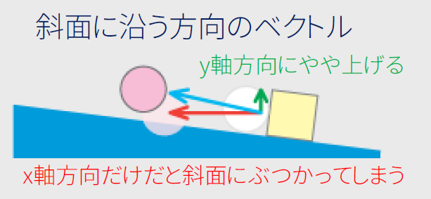

- 「**Bumper**」スクリプトを「**Paddle**」オブジェクトにattachする
  - attachする方法は3つあります
    1. 「**Hierarchy**」上の「**Paddle**」にattachする方法（説明省略）
    2. 「**Scene**」ビュー上の「**Paddle**」にattachする方法（説明省略）
    3. 「**Paddle**」の「**Inspector**」内の「**Add Componet**」でattachする方法（説明省略）

- 「**Play**」を押して実行してみましょう
  - 「**Ball**」が「**Paddle**」に当たったときの跳ね返りを調整してください
  - 跳ね返すを調整したい場合は，「**Paddle**」オブジェクトの「**Bumper**」スクリプト内にある「**Bounce**」の値を変更してみていください

## 「失敗」（取り損ねた）ボールの消去

### 「Kill」スクリプトの中身を編集

- 「**Kill**」スクリプトを中身を以下のように編集します

```csharp
using System.Collections;
using System.Collections.Generic;
using UnityEngine;

public class Kill : MonoBehaviour {

  void OnCollisionEnter(Collision other) {
    // killWallオブジェクトに当たったオブジェクトのタグが「Ball」の場合以下の処理をおこなう
    if(other.gameObject.name == "Ball") {
      // 当たったオブジェクトを0.1秒後に削除する
      Destroy(other.gameObject, 0.1f);
    }
  }
}
```

- 「**kill**」スクリプトを「**KillWall**」オブジェクトにattachします

- 「**Play**」を押して実行してみましょう
  - 「**Ball**」が「KillWall」に当たったときに「Ball」が消えるか確認してください

## ボールの再セットする仕組み

- 「失敗」（取りそこねる）とボールを消すことをします
- 次にボールを再セットする仕組み（リプレイ）をつくります
- これで繰り返しゲームを遊ぶことができます
- 「ゲームの進行工程（シーケンス）」

## 「GameManager」を作りゲームを管理する

- C#スクリプトの作成とファイルに名前をつけます
- スクリプトの名前はとても大切です（後から変更するのが大変です）
- 名前は大文字から始まる名前にします（記号などは使えません）
- ここでは「**GameManager**」という名前にします

- 「**Project**」の「**Assets**」内にある「**Script**」フォルダを選択します
- Scriptフォルダ内が表示されるのでそこで「**右クリック**」をします
- 表示されたリストの一番上にある「**Create**」を選択します
- 更に表示されたリストの上から二番目にある「**C# Script**」を選択します

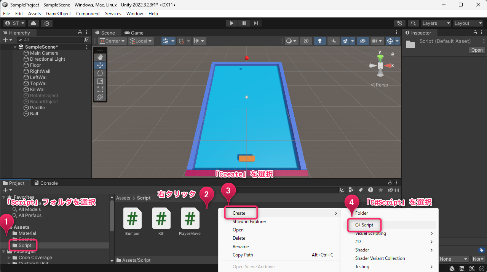

- スクリプトアイコンが表示されます
- すぐにファイル名を「**GameManager**」に変更してください
- 「Empty（空っぽ）」のゲームオブジェクトをつくります
- 「**GameObject**」を選択します
- 表示されたリストから「**Create Empty**」を選択します

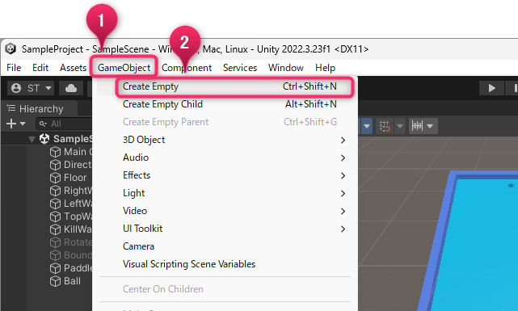

- 作成した空っぽの「**GameObject**」オブジェクトを選択します
- Inspectorからオブジェクト名を「**GameManager**」とします
- 「**GameManager**」スクリプトをattachします

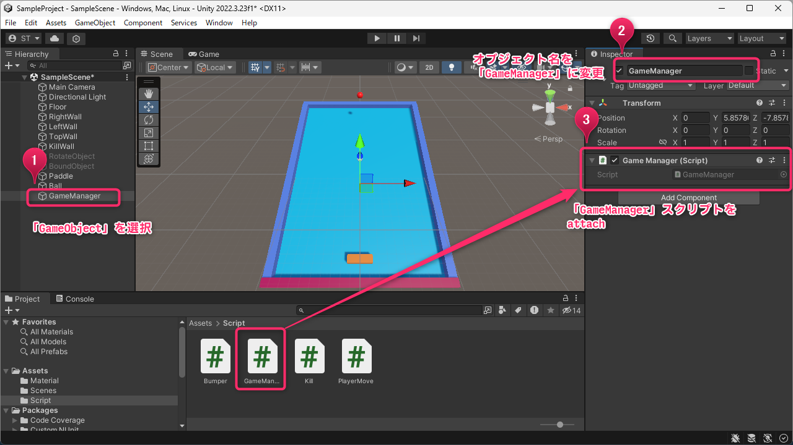

- 「GameManager」スクリプトの中身を編集します

```cs
using System.Collections;
using System.Collections.Generic;
using UnityEngine;
public class GameManager : MonoBehaviour
{
  // GameObject型の「ballPrefab」という名前の変数を作成
  public GameObject ballPrefab;
  
  void Update()
  {
    // オブジェクト名が「Ball」のオブジェクトを探して，GameObject型の変数「ballObj」にいれる
    GameObject ballObj = GameObject.Find("Ball");
    // 「ballObj」の中身がScene内に存在しなくなったら以下の処理を行う
    if (ballObj == null)
    {
      // Inspector欄でセットされたオブジェクト「ballPrefab」を作成してGameObject型の変数「newBall」にいれる
      GameObject newBall = Instantiate(ballPrefab);
      // 「ballPrafab」の名前を「newBall」の名前にいれる
      newBall.name = ballPrefab.name;
    }
  }
}
```

## 「Ball」のPrefabを作成します

- Hierarchy内の「**Ball**」オブジェクトをドラッグします
- そのまま「**Assets**」にドロップします
- Hierarchy内の「**Ball**」オブジェクトが青くなります

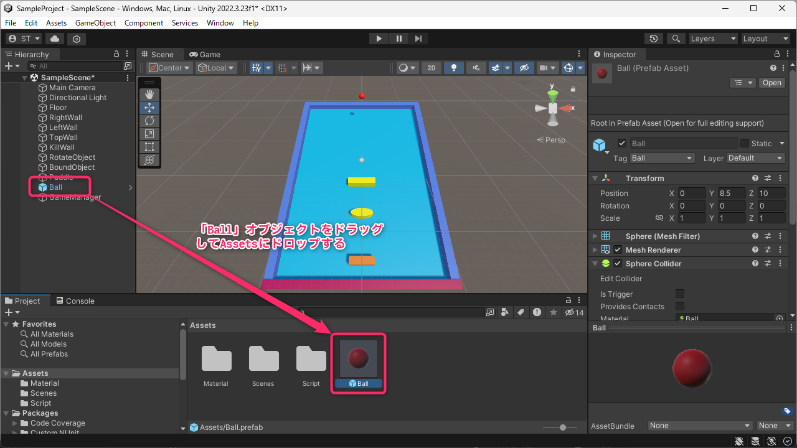

- Hierarchyの「**GameManager**」オブジェクトを選択します
- Inspectorの「**GameManager**」コンポーネントを確認します
- 先ほど作成したAssets内の「**Ball**」プレファブを「**GameManager**」コンポーネントの「**Ball Prefab**」にドラッグアンドドロップします

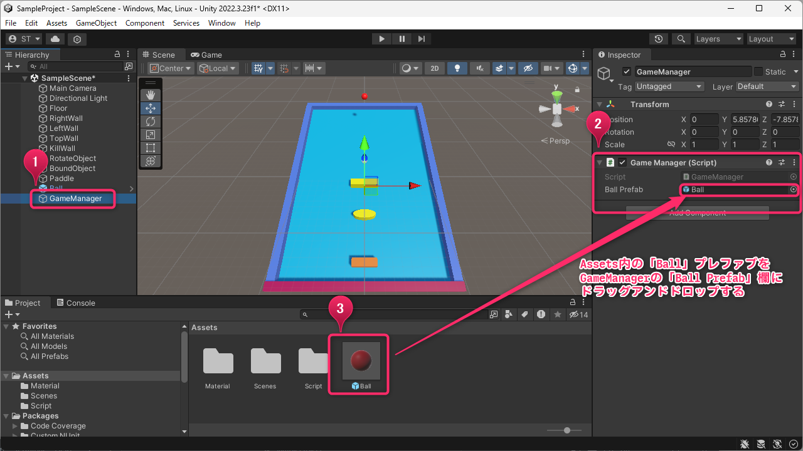

- 「**Play**」を押して実行してみましょう
  - 「**Ball**」が「**KillWall**」に当たったときに「**Ball**」が消え再度「**Ball**」が表示されるか確認してください

# ボールを跳ね返すオブジェクト

- Hierarchy内の「**BoundObject*」を選択してください
- 「**BoundObject**」に「**Bumper**」スクリプトをattachしてください

- 「**Play**」を押して実行してみましょう
  - 「**Ball**」が「**BoundObject**」に当たったときに跳ね返ることを確認してください

# 回転するオブジェクト

## 「Rotation」スクリプトを作成してattachします

- C#スクリプトの作成とファイルに名前をつけます
- スクリプトの名前はとても大切です（後から変更するのが大変です）
- 名前は大文字から始まる名前にします（記号などは使えません）
- ここでは「Rotation」という名前にします

- 「**Project**」の「**Assets**」内にある「**Script**」フォルダを選択します
- Scriptフォルダ内が表示されるのでそこで「**右クリック**」をします
- 表示されたリストの一番上にある「**Create**」を選択します
- 更に表示されたリストの上から二番目にある「**C# Script**」を選択します

Unity-020.png

- Rotationスクリプトを中身を編集します

```csharp
using System.Collections;
using System.Collections.Generic;
using UnityEngine;
using UnityEngine.AI;

public class Rotation : MonoBehaviour
{
  // float型のrotAngle変数に4.0を入れる
  public float rotAngle = 4.0f;
  
  void FixedUpdate()
  {
    // Inspector欄のtransformのRotateのY軸の回転にrotAngleの角度だけ回転させる
    transform.Rotate(0f, -rotAngle, 0f);
  }
}
```

- Hierarchy欄の「**RotateObject**」オブジェクトに「**Rotation**」スクリプトをattachしてください

- 「**Play**」を押して実行してみましょう
  - 「**RotateObject**」が回転していることを確認してください
  - 回転速度を調整したい場合は，「**RotateObject**」オブジェクトの「**Rotation**」スクリプト内にある「**Rot Angle**」の値を変更してみてください

## 課題

- ゲームを完成させていください
- 完成したゲームを更に改造してください
- レポートテンプレートをMoodleからダウンロードしてください
- レポートを作成してください
  - アピールポイント
  - プレイ時のスクショ
  - 今回の授業を通して楽しかったこと
  - 今回の授業を通して大変だった，難しかったこと
- 提出はレポートをPDFに変換してMoodleに提出してください
- 提出期限：**翌週月曜日23:59まで**